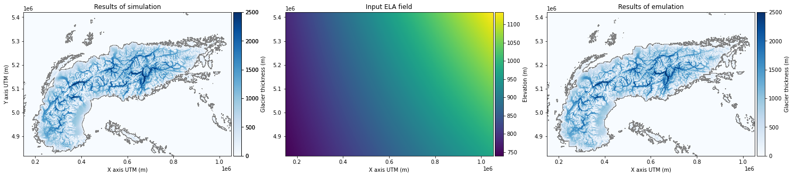
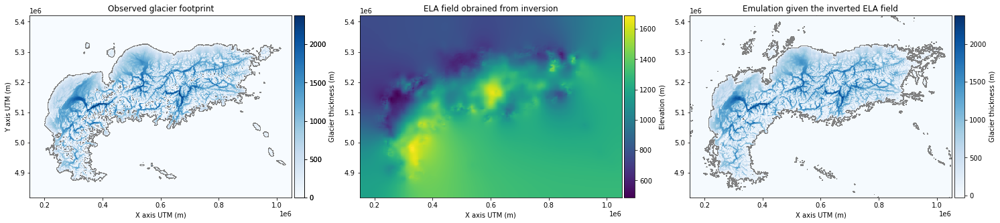

# Retrieving Climatic and Temporal Insights from the Last Glacial Maximum Using an Inverted Glacier Model

## Overview
This project aims to reconstruct past climatic conditions during the Last Glacial Maximum (LGM) by inverting paleo-glacier footprints using a novel glacier evolution model integrated with a machine-learning-based emulator. The approach refines traditional equilibrium line altitude (ELA) reconstruction techniques by incorporating glacier dynamics and transient climate variability, providing a more comprehensive understanding of past climate patterns.

## Project Components
The project is structured into two main phases:

### 1. Emulation
The emulation phase involves training a machine-learning-based emulator to replicate the results of a full glacier evolution model. This significantly reduces computational costs while maintaining accuracy. The emulator is trained on synthetic glacier simulations. The primary objectives of this phase include:
- Constructing a convolutional neural network to predict glacier maximal thickness.
- Generating synthetic glacier data using the Instructed Glacier Model (IGM).
- Training the emulator on paleo-glacier simulations.


*Figure 1: Emulation process overview.*

### 2. Inversion
The inversion phase applies an optimization approach to reconstruct paleo-ELA fields using observed glacier footprints. By leveraging automatic differentiation, the model iteratively refines ELA predictions to minimize the discrepancy between simulated and observed glacier extents. Key aspects include:
- Implementing an adaptive moment estimation (ADAM) algorithm to optimize ELA fields.
- Using regularization techniques to enforce physically plausible solutions.
- Analyzing the relationship between reconstructed ELA fields and climatic forcing variables.


*Figure 2: Inversion process overview.*


## Getting Started
To set up and run the project, follow these steps:

1. **Clone the repository:**
   ```sh
   git clone https://github.com/your-username/PaleoClimateRecon.git
   ```
2. **Install dependencies:**
   ```sh
   pip install -r requirements.txt
   ```
3. **Run the emulation process:**
   ```sh
   python train_emulator.py
   ```
4. **Run the inversion process:**
   ```sh
   python invert.py
   ```
5. **Analyze and visualize results:**
   - Outputs will include reconstructed ELA maps and inferred paleo-climate patterns.

## Contributions
Contributions to this project are welcome! To contribute:
- **Fork the repository**
- **Create a feature branch:**
  ```sh
  git checkout -b feature/your-feature-name
  ```
- **Commit your changes:**
  ```sh
  git commit -am 'Add a detailed description of your change'
  ```
- **Push the branch:**
  ```sh
  git push origin feature/your-feature-name
  ```
- **Submit a pull request**

## License
This project is licensed under the [UNIL License](LICENSE).

## Acknowledgments
This work is based on research conducted at the Institute of Earth Surface Dynamics, University of Lausanne. The project leverages open-source computational tools, with code available at:
[https://github.com/your-username/PaleoClimateRecon](https://github.com/your-username/PaleoClimateRecon).

